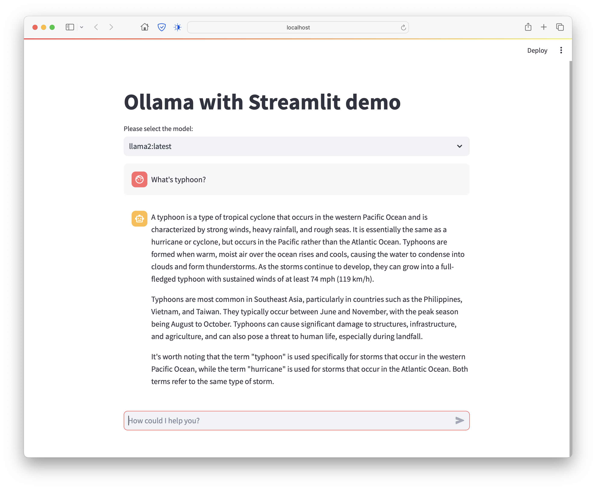

# Ollama with streamlit demo


* 完整教學：[使用ollama運行本地端大型語言模型並透過streamlit快速建立簡易版聊天機人網頁](https://willy756-taiwan.medium.com/%E4%BD%BF%E7%94%A8ollama%E9%81%8B%E8%A1%8C%E6%9C%AC%E5%9C%B0%E7%AB%AF%E5%A4%A7%E5%9E%8B%E8%AA%9E%E8%A8%80%E6%A8%A1%E5%9E%8B%E4%B8%A6%E9%80%8F%E9%81%8Estreamlit%E5%BF%AB%E9%80%9F%E5%BB%BA%E7%AB%8B%E7%B0%A1%E6%98%93%E7%89%88%E8%81%8A%E5%A4%A9%E6%A9%9F%E5%99%A8%E4%BA%BA%E7%B6%B2%E9%A0%81-c2581a612b3b?source=friends_link&sk=6eb9877a122d746f22cc7e7955c1835d)
* Based on [ollama-python](https://github.com/ollama/ollama-python) and [Build a basic LLM chat app](https://docs.streamlit.io/knowledge-base/tutorials/build-conversational-apps)
* You can select the specified LLM.
  

## Requirement

* python >=3.10.9
* streamlit==1.31.0
* ollama==0.1.6 (python package)
* [ollama server](https://github.com/ollama/ollama)

# Run

```shell
$ streamlit run main.py
```
